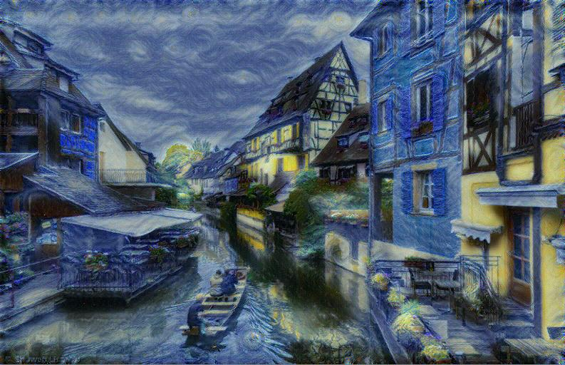
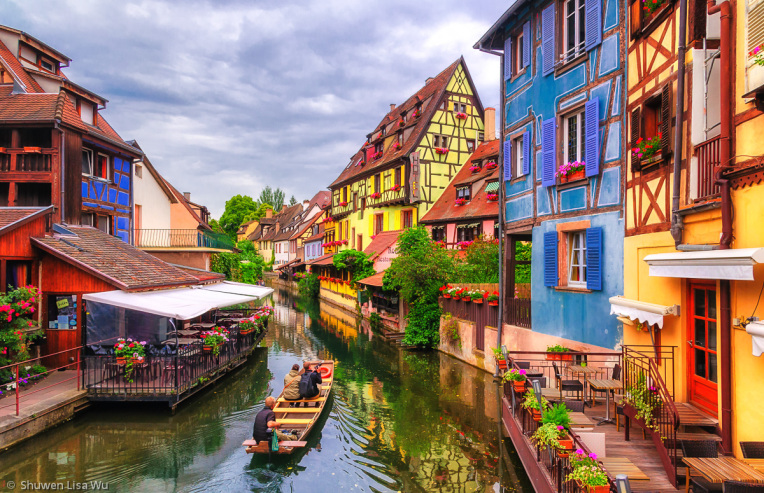

# neural-style
A **PyTorch** implementation of Neural Style which is a neural algorithm that can transform Artistic Style of images.

The algorithm can apply a image artistic style(style image) on another image(content image). For example, we can transfer the
normal photo to famous art work style.

The implementation is based on the [paper 'Image Style Transfer Using Convolutional Neural Networks'](https://www.cv-foundation.org/openaccess/content_cvpr_2016/papers/Gatys_Image_Style_Transfer_CVPR_2016_paper.pdf). But I use the **SqueezeNet** as the **Convolutional Neural Network**(_CNN_ for short) instead of _VGG19(19-layer VGG)_ in the paper.

SqueezeNet is a light weight CNN, the algorithm runs faster with SqueezeNet.

# Requirement & How to Work

PyTorch are only available on linux and OSX now(2017/02)  

1. python >= 3.4
2. install pytorch(torch >= 0.1.1, torchvision).
 * follow the introduction in [PyTorch homepage](http://pytorch.org/)
 * choose the right package based on your OS , python version and CUDA version
 * no CUDA means only CPU, AMD GPU is not available for CUDA.
3. `python neural-sytle.py` or `python3 neural-sytle.py`. run the main file.
 * the generated sytle transfer result is in the `output` directory.
 * You can custom your own `content image` and `style image`, change the image path
 parameter to yours.

# Examples

The photo with starry night sytle.

The original photo (content image)

Starry Night - Vincent van Gogh (style image)

I put only one example on the github considering the size of the project.

For more examples on my blog
[http://www.mix-flow.com/2017/06/27/image-style-transfer-using-neural-style/](http://www.mix-flow.com/2017/06/27/image-style-transfer-using-neural-style/)
